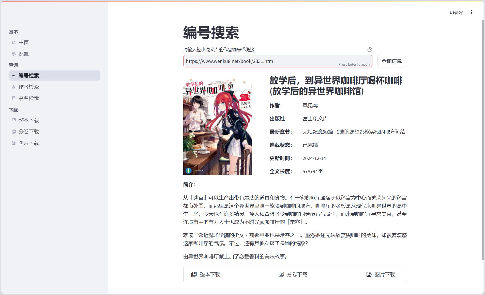

# 轻小说下载器

**Wenku8Downloader** 是基于 Python 和 [Streamlit](https://streamlit.io/) 构建的一款本地工具，提供基于 Web 的操作页面，用于下载 [轻小说文库](https://www.wenku8.net/) 的小说并保存为 EPUB 格式。



## 基本功能

下载文件均默认存储在 `/downloads` 目录下：

- ✅ 查询文库中的小说信息（支持按编号、书名、作者查询）
- ✅ 下载整本小说或分卷下载
- ✅ 单独下载小说插图
- ✅ 个性化下载配置
- ✅ **自动突破 Cloudflare 盾与 403 拦截**（无需任何额外驱动，内置原生 TLS 指纹伪造）
- ✅ **自带异常自愈与重试机制**（包含连接失败、网页限流 5 秒防刷等处理）
- ⚠️ 暂不支持下载已下架小说

## 使用方法

本项目基于 `Python 3.9` 构建，请在使用前自行配置环境（无需额外配置 Playwright 或浏览器驱动）。

1. **将项目拉取到本地**

   ```bash
   git clone https://github.com/mj3622/Wenku8Downloader.git
   cd Wenku8Downloader
   ```

2. **创建并激活虚拟环境**

   ```bash
   # 创建
   python -m venv myenv
   
   # 激活 (Windows)
   myenv\Scripts\activate
   
   # 激活 (macOS/Linux)
   source myenv/bin/activate
   ```

3. **安装依赖**

   ```bash
   pip install -r requirements.txt
   ```

4. **配置应用（可选）**

   系统首次启动时会自动基于模板生成 `config/secrets.toml` 配置文件。
   你可以直接在应用内置的 Web 端「配置」页面中设定各项参数（如代理、登录账号、Cookie 及默认封面等），无需手动复制或修改配置文件。如不配置，系统将以默认设定直连运行。

5. **启动应用**

   ```bash
   streamlit run app.py
   ```

**补充说明（Windows 一键运行脚本）：**

为方便后续使用，可自行在项目根目录下创建 `start.bat` 文件实现一键启动，参考示例如下：

```bat
@echo off
:: 进入当前目录
cd /d %~dp0

:: 激活虚拟环境
call myenv\Scripts\activate

:: 运行 Streamlit 应用
streamlit run app.py

:: 保持命令行窗口开启
pause
```

## 常见问题

### 1. 频繁提示被拦截或抛出 403 错误

目前的底层请求由 `curl_cffi` 接管，在遭受 Cloudflare 的防御拦截时，后台会自动休眠 5~8 秒并**自动更换一套全新的浏览器 TLS 指纹并重试（最高 3 次）**，通常会在重试的第 2 次成功加载。如果界面最终直接提示 403 并终止：
1. 请进入 Web 端的全局「配置」页，将所有的 Cookie 留空并点击保存，随后重新获取。
2. 网站可能针对你的 IP 执行了长达分钟级的完全封禁，这种情况下请在 `config/secrets.toml` 的 `[proxy]` 节点配置有效代理。

### 2. 代理的配置问题

项目不再硬性要求配置代理。如果在 `config/secrets.toml` 中留空（如 `http=""`），系统将会自动使用直连网络进行爬取。

### 3. 小说查询或下载失败

请先检查该书是否为已下架小说，当前暂不支持对下架小说的下载操作。若仍有问题，可能是当前网络完全阻断了该文库站点的访问。

### 4. 分卷下载时封面异常

分卷下载时，默认首张插图作为当卷的封面。你可以在 Web 端的「基本-配置」页面中进行修改，或设置 `config/secrets.toml` 中的 `default_cover_index` 选项以调整默认行为。