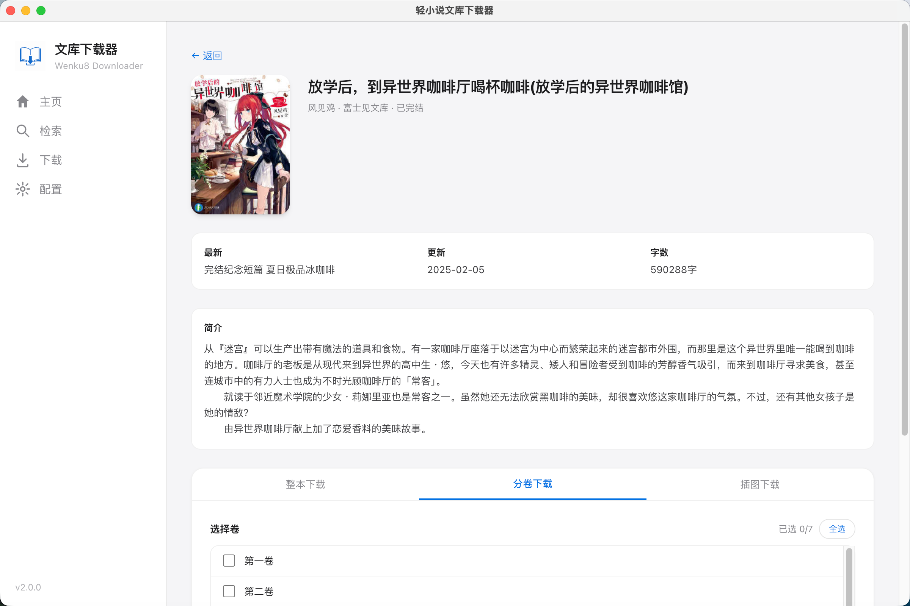

<p align="center">
  
</p>

<h1 align="center">轻小说文库下载器</h1>

<p align="center">
  把喜欢的轻小说打包带走：检索、下载、插图收藏、EPUB 导出，一站式完成。
</p>

<p align="center">
  <a href="https://github.com/mj3622/Wenku8Downloader/releases"></a>
  <a href="LICENSE"></a>
  <a href="https://github.com/mj3622/Wenku8Downloader/releases"></a>
  
  
  
</p>

<p align="center">
  
</p>

## ✨ 这是什么？

**轻小说文库下载器**是一款面向桌面端的轻小说下载工具，用来从[轻小说文库](https://www.wenku8.net/)检索作品，并将小说内容整理导出为 EPUB 文件。

它适合想把小说放进阅读器、平板、手机里慢慢看的用户：打开应用，配置账号，搜索作品，选择整本或分卷下载，然后就可以把一本本轻小说收进自己的电子书架。

> 请在遵守目标站点规则与版权要求的前提下使用本工具。本项目仅用于个人学习、资料整理与技术交流。

## 🚀 功能亮点

| 功能 | 说明 |
| --- | --- |
| 🔍 多维度检索 | 支持按小说编号、书名、作者搜索，找书不用来回翻页 |
| 📚 EPUB 导出 | 支持整本合并导出，也支持按分卷独立导出 |
| 🖼️ 插图下载 | 可单独提取指定卷插图，封面、彩插、插画都能整理保存 |
| 🧭 自动登录 | 在配置页填写账号后，应用会辅助获取登录状态，减少手动操作 |
| 🐢 智能限流 | 根据服务器响应自动调整下载节奏，降低触发访问限制的概率 |
| 🔁 下载管理 | 下载历史、任务进度、失败重试都集中管理 |
| 📁 自定义路径 | EPUB 与插图保存到哪里，由你决定 |
| 💻 桌面体验 | 基于 Electron 重写，macOS / Windows 打开即用 |

## 📦 下载安装

前往 [Releases](https://github.com/mj3622/Wenku8Downloader/releases) 下载最新版本：

- **macOS Apple Silicon**：选择 `macOS-arm64.dmg`
- **macOS Intel**：选择 `macOS-x64.dmg`
- **Windows**：选择 `Windows-x64.exe` 便携版

安装方式很简单：

- macOS：打开 `.dmg`，把应用拖进 `Applications` 文件夹
- Windows：下载 `.exe` 后直接双击运行

## 🧭 使用流程

1. **配置账号**  
   打开「配置」页，填写轻小说文库账号与密码，保存后获取登录状态。

2. **设置下载路径**  
   在「配置」→「下载设置」中选择文件保存位置。留空时，会使用系统默认下载目录。

3. **搜索目标作品**  
   在「检索」页输入小说编号、书名或作者名，找到想下载的作品。

4. **选择下载方式**  
   进入作品详情页后，可以选择整本下载，也可以只勾选需要的分卷。

5. **查看下载历史**  
   在「下载历史」页查看进度、打开文件夹，失败任务也可以重新尝试。

登录状态过期时，回到配置页点击「刷新 Cookie」即可重新获取。

## 🧪 开发与构建

```bash
git clone https://github.com/mj3622/Wenku8Downloader.git
cd Wenku8Downloader
npm install

# 启动开发模式
npm run dev

# 代码检查与测试
npm run typecheck
npm run lint
npm test

# 构建安装包
npm run dist:mac     # 构建 macOS DMG
npm run dist:win     # 构建 Windows 便携版
npm run dist         # 同时构建 macOS 与 Windows
```

国内网络环境下，如果 Electron 下载较慢，可以临时设置镜像源：

```bash
ELECTRON_MIRROR=https://npmmirror.com/mirrors/electron/ \
ELECTRON_BUILDER_BINARIES_MIRROR=https://npmmirror.com/mirrors/electron-builder-binaries/ \
npm run dist:mac
```

## 🧩 技术栈

- **桌面端**：Electron 31、electron-vite、electron-builder
- **前端界面**：React 18、TypeScript、Tailwind CSS、Zustand
- **内容解析**：cheerio、iconv-lite
- **文件生成**：JSZip
- **自动化能力**：puppeteer-core、puppeteer-extra、stealth plugin
- **测试工具**：Vitest

## 📁 项目结构

```text
Wenku8Downloader/
├── resources/          # 应用图标与截图资源
├── src/
│   ├── main/           # Electron 主进程
│   ├── preload/        # 预加载脚本与安全桥接
│   └── renderer/       # React 渲染进程页面
├── package.json        # 脚本、依赖与打包配置
└── README.md
```

## ❓ 常见问题

### 为什么需要账号？

部分内容需要登录状态才能正常访问。应用会在本地辅助获取并使用登录 Cookie。

### 下载失败怎么办？

可以先在「下载历史」中重试；如果仍然失败，建议稍后再试，或检查当前网络环境与账号登录状态。

### 可以只下载插图吗？

可以。作品详情页支持按卷下载插图，适合单独整理封面和彩插。

## 📜 License

本项目基于 [MIT License](LICENSE) 开源。

---

<p align="center">
  希望它能帮你把想读的故事，稳稳装进口袋里的电子书架。
</p>
