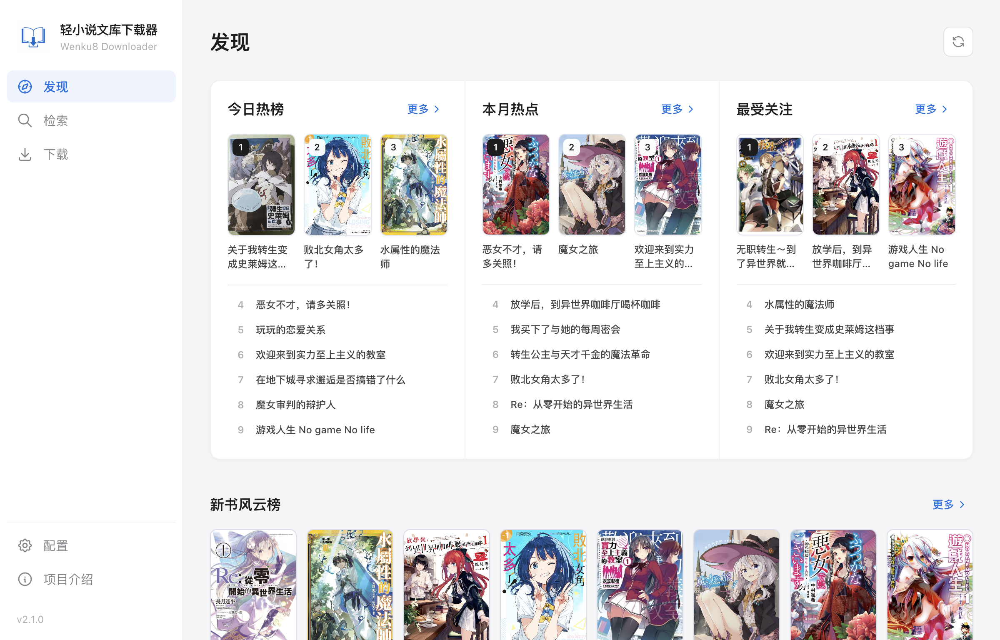
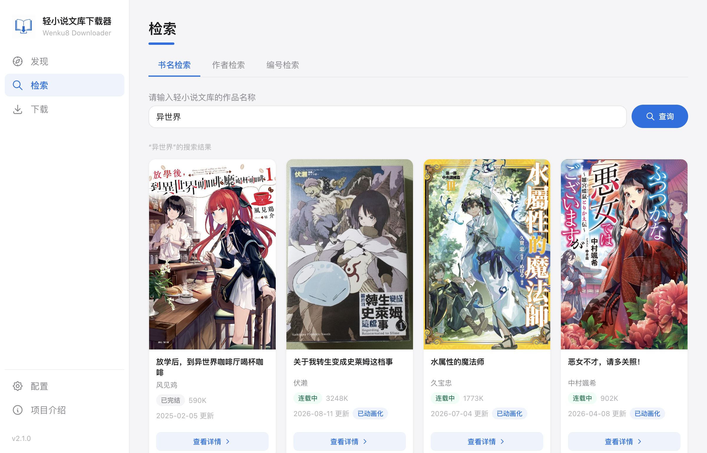
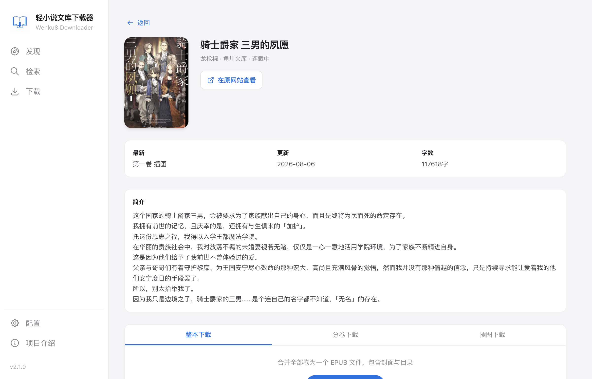

<p align="center">
  
</p>

<h1 align="center">轻小说文库下载器</h1>

<p align="center">
  把喜欢的轻小说打包带走：检索、下载、插图收藏、EPUB 导出，一站式完成
</p>

<p align="center">
  <a href="https://github.com/mj3622/Wenku8Downloader/releases"></a>
  <a href="LICENSE"></a>
  <a href="https://github.com/mj3622/Wenku8Downloader/releases"></a>
</p>

<p align="center">
  
</p>

<p align="center"><sub>发现页会集中展示热门榜单、新书推荐与站内排行</sub></p>

## ✨ 这是什么？

**轻小说文库下载器**是一款面向桌面端的轻小说下载工具，用来从[轻小说文库](https://www.wenku8.net/)检索作品，并将小说内容整理导出为 EPUB 文件

它适合想把小说放进阅读器、平板、手机里慢慢看的用户：打开应用，配置账号，搜索作品，选择整本或分卷下载，然后就可以把一本本轻小说收进自己的电子书架

> 请在遵守目标站点规则与版权要求的前提下使用本工具。本项目仅用于个人学习、资料整理与技术交流。

## 🚀 功能亮点

| 功能 | 说明 |
| --- | --- |
| 🔍 多维度检索 | 支持按小说编号、书名、作者搜索，找书不用来回翻页 |
| 🧭 作品发现 | 以封面浏览首页推荐、热门内容与完整排行榜，支持分页查看 |
| 📚 EPUB 导出 | 支持整本合并导出，也支持按分卷独立导出 |
| 🖼️ 插图下载 | 可单独提取指定卷插图，封面、彩插、插画都能整理保存 |
| 🧭 自动登录 | 在配置页填写账号后，应用会辅助获取登录状态，减少手动操作 |
| 🐢 智能限流 | 根据服务器响应自动调整下载节奏，降低触发访问限制的概率 |
| 🔁 下载管理 | 下载历史、任务进度、取消与中断后重试都集中管理 |
| 📁 自定义路径 | EPUB 与插图保存到哪里，由你决定 |
| 💻 桌面体验 | 基于 Electron 重写，macOS / Windows 打开即用 |

## 🖼️ 更多界面

### 搜索结果

按书名或作者搜索后，会以封面卡片展示匹配作品及状态信息

<p align="center">
  
</p>

### 作品详情

作品详情页会展示封面、作者、更新状态、简介与分卷信息，并提供整本、分卷和插图三种下载方式

<p align="center">
  
</p>

## 📦 下载安装

前往 [Releases](https://github.com/mj3622/Wenku8Downloader/releases) 下载最新版本：

- **macOS Apple Silicon**：选择 `macOS-arm64.dmg`
- **macOS Intel**：选择 `macOS-x64.dmg`
- **Windows**：选择 `Windows-x64.exe` 便携版

macOS 版本要求为 13 Ventura 或更高版本

当前发布的 macOS 安装包未签名，系统首次打开时会显示安全提醒，可在 Finder 中右键应用选择「打开」

安装方式很简单：

- macOS：打开 `.dmg`，把应用拖进 `Applications` 文件夹
- Windows：下载 `.exe` 后直接双击运行

## 🧭 使用流程

1. **配置账号**  
   打开「配置」页，填写轻小说文库账号与密码，保存后获取登录状态

2. **设置下载路径**  
   在「配置」→「下载设置」中选择文件保存位置，留空时会使用系统默认下载目录

3. **发现或搜索作品**<br />
   在「发现」页浏览推荐与排行榜，或在「检索」页按编号、书名、作者查找目标作品

4. **选择下载方式**  
   进入作品详情页后，可以选择整本下载，也可以只勾选需要的分卷

5. **查看下载历史**  
   在「下载历史」页查看进度、取消任务或打开文件夹；失败、已取消和已中断的任务都可以重试

登录状态过期时，回到配置页点击「刷新登录状态」即可重新获取

## ❓ 常见问题

遇到登录、网络、检索或下载问题时，请查看[常见问题](docs/FAQ.md)

## 🧪 开发与构建

```bash
git clone https://github.com/mj3622/Wenku8Downloader.git
cd Wenku8Downloader
npm install
npm run dev
```

项目要求 Node.js 22.12 或更高版本。提交改动前可运行：

```bash
npm test
npm run lint
npm run typecheck
npm run build
```

## 📄 开源许可

本项目基于 MIT License 开源，详情请查看 [LICENSE](LICENSE) 文件
